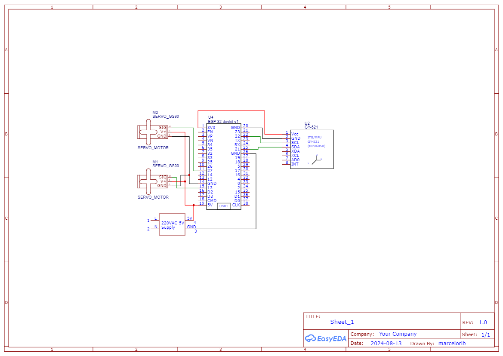

# Projeto Sistemas Embarcados IFPB

Este documento descreve as funções implementadas para a comunicação com um **servo motor** e um **sensor MPU6050** utilizando o **ESP32-IDF**. O objetivo é controlar os ângulos do servo motor e ler os dados de aceleração, giroscópio e temperatura, além de realizar o cálculo de quaternions e ângulos de Euler.

## Requisitos

- 1x MCU ESP32
- 2x Servo Motor (GS90)
- 1x MPU6050
- Builder: ESP-IDF
- Bibliotecas:
  - `stdio.h`
  - `freertos/FreeRTOS.h`
  - `freertos/task.h`
  - `esp_err.h`
  - `esp_log.h`
  - `driver/ledc.h`
  - `esp_system.h`
  - `esp_random.h`
  - `math.h`
  - `driver/i2c.h`
  - `driver/gpio.h`

## Portas utilizadas na ESP32
- Servo Motor: PWM - GPIO PIN 13
- MPU6050: 
  - SDA - GPIO PIN 21
  - SCL - GPIO PIN 22

## Funções Implementadas

### Funções para o Servo Motor

#### `esp_err_t servo_init(ServoConfig *config)`

**Descrição**:  
Inicializa o servomotor com base na configuração fornecida e verifica se o servo está respondendo corretamente.

**Parâmetros**:  
- `config` - Struct com as configurações do servo.

**Retorno**:  
- `ESP_OK`, `ESP_FAIL`, `ESP_ERR_INVALID_ARG`

---

#### `esp_err_t servo_set_angle(ServoConfig *config, int angle)`

**Descrição**:  
Define o ângulo do servomotor, movendo o braço acoplado ao rotor para a angulação desejada.

**Parâmetros**:  
- `config` - Configuração do servo.
- `angle` - Ângulo desejado.

**Retorno**:  
- `ESP_OK`, `ESP_FAIL`

---

#### `esp_err_t servo_get_angle(const ServoConfig *config, ServoAngle *angle)`

**Descrição**:  
Obtém o ângulo atual do braço do servomotor.

**Parâmetros**:  
- `config` - Configuração do servo.
- `angle` - Ângulo atual.

**Retorno**:  
- `ESP_OK`, `ESP_FAIL`

---

#### `esp_err_t hw_servo_init(uint8_t gpio_num)`

**Descrição**:  
Prepara o pino GPIO para gerar sinais PWM.

**Parâmetros**:  
- `gpio_num` - Número do pino GPIO.

**Retorno**:  
- `ESP_OK`, `ESP_FAIL`

---

#### `esp_err_t hw_servo_set_pulse_width(uint8_t gpio_num, uint32_t pulse_width_us)`

**Descrição**:  
Ajusta a largura do pulso PWM, controlando a posição do servo motor.

**Parâmetros**:  
- `gpio_num` - Pino do GPIO.
- `pulse_width_us` - Largura do pulso PWM em microsegundos.

**Retorno**:  
- `ESP_OK`, `ESP_FAIL`

---

#### `esp_err_t hw_servo_deinit(uint8_t gpio_num)`

**Descrição**:  
Desativa o sinal PWM e libera os recursos.

**Parâmetros**:  
- `gpio_num` - Pino do GPIO.

**Retorno**:  
- `ESP_OK`, `ESP_FAIL`

---

### Funções para o MPU6050

#### `esp_err_t imu_init(uint8_t devAddr, gpio_num_t sda_pin, gpio_num_t scl_pin)`

**Descrição**:  
Inicializa o sensor MPU6050, configurando a comunicação I2C.

**Parâmetros**:  
- `devAddr` - Endereço I2C do sensor.
- `sda_pin` - Pino SDA.
- `scl_pin` - Pino SCL.

**Retorno**:  
- `ESP_OK`, `ESP_FAIL`, `ESP_ERR_NOT_FOUND`

---

#### `esp_err_t imu_get_acceleration_data(AccelerationData *data)`

**Descrição**:  
Lê os dados de aceleração do sensor.

**Parâmetros**:  
- `data` - Estrutura para armazenar os dados de aceleração.

**Retorno**:  
- `ESP_OK`, `ESP_FAIL`

---

#### `esp_err_t imu_get_gyroscope_data(GyroscopeData *data)`

**Descrição**:  
Lê os dados do giroscópio.

**Parâmetros**:  
- `data` - Estrutura para armazenar os dados do giroscópio.

**Retorno**:  
- `ESP_OK`, `ESP_FAIL`

---

#### `esp_err_t imu_deinit()`

**Descrição**:  
Desinstala o driver I2C.

**Retorno**:  
- `ESP_OK`

---

#### `esp_err_t imu_read_data(IMUData *data)`

**Descrição**:  
Lê todos os dados do IMU (aceleração e giroscópio).

**Parâmetros**:  
- `data` - Estrutura para armazenar os dados do IMU.

**Retorno**:  
- `ESP_OK`, `ESP_FAIL`

---

#### `esp_err_t imu_calculate_quaternion(const IMUData *data, Quaternion *quaternion)`

**Descrição**:  
Calcula o quaternion utilizando os dados de aceleração.

**Parâmetros**:  
- `data` - Dados do IMU.
- `quaternion` - Estrutura para armazenar o quaternion.

**Retorno**:  
- `ESP_OK`

---

#### `esp_err_t imu_calculate_euler_angles(const Quaternion *quaternion, EulerAngle *euler)`

**Descrição**:  
Converte o quaternion em ângulos de Euler (roll, pitch, yaw).

**Parâmetros**:  
- `quaternion` - Quaternion calculado.
- `euler` - Estrutura para armazenar os ângulos de Euler.

**Retorno**:  
- `ESP_OK`

---

### `void app_main()`

**Descrição**:  
Função principal que inicializa o IMU, lê os dados do sensor e imprime os resultados.

---

## Esquemático

---

## Máquina de Estados

---

## Diagrama de Blocos

---

## Protótipo

[Veja o projeto no Wokwi!](https://wokwi.com/projects/409870011810357249)

---

## Autores

- [Antonio Roberto](https://github.com/antoniojunior2222)
- [Aryelson Gonçalves](https://github.com/aryelson1)
- [Clarissa Lucena](https://github.com/Clarissa-de-Lucena)
- [Felipe Braz](https://github.com/felipebrazfb333)
- [Guilherme Santos](https://github.com/GuilhermexL)
- [Marcelo Ribeiro](https://github.com/Marcelo-RSilva)

---

Agora a documentação inclui ambos os módulos (Servo Motor e MPU6050), com os requisitos e funções devidamente unificados e sem duplicações.
